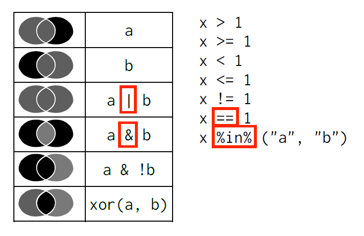

```{r, message=FALSE, warning=FALSE, include=FALSE}
library(tidyverse)
```


# Focusing on filter, select, group_by and summarise

## Filter
The most important thing you can do to do with the data is filter is down to smaller pieces.
You can filter the data in different ways, as detailed in the image below.



** Example: Find all the cars from Audi or Volkswagen: **
```{r}
mpg %>% filter(manufacturer %in% c("audi", "volkswagen"))
```

## Select
Select columns of data based on the name of the column.
- Select groups of columns by col1:coln, where the columns you want are col1, coln and all the columns in between.
- Select columns by calling them out by name (the most common way)
- You can deselect columns by using a negative sign. I.E. select(-col5) will select everything except col5.

**Example: Select  manuafacturer, model, year, cty and hwy.**
Two ways to do the same thing!
```{r}
select(mpg, manufacturer, model, year, cty, hwy)
select(mpg, manufacturer:hwy, -displ, -trans, -cyl, -drv)
```

## Arrange
Arrange the data to be sorted by a particular column

**Example: What model / year of car get's the worst highway MPG?**
```{r}
arrange(mpg, hwy)
```


## Mutate: Make new variables
Mutate the original data frame to have additional columns.
You are always given the SAME amount of rows back.

**Example: Convert the MPG to KPL for both highway and city speeds.**

```{r}
mutate(mpg, hwy.kpl = hwy * 0.4251, hwy.cty = cty * 0.4251)
```

**You do: Add a column to the mpg data set with a flag for "non-energy efficient" cars. Define 
this as a HWY MPG below 30 mpg.**

```{r, echo=F, include =F, eval=F}
mpg %>% mutate(not.energ.eff = ifelse(hwy < 30, 1, 0))
```


## Group By / Summarize
This is how you might create a pivot_table like object.
You group columns together to get a summary value.
The summarise function create the summary statistic.

Summary Statistic | R expression
------------- | -------------
Average / mean | `mean()`
Maximum | `max()`
Minimum | `min()`
Median | `median()`
Standard deviation | `sd()`
Count | `n()`
Count Distinct | `n_distinct()`


```{r}
# use dplyr to group by species and compute the average and standard deviation of sepal length for each species
iris %>%
  group_by(Species) %>%
  summarize(mean_sepal_length=mean(Sepal.Length),
            sd_sepal_length=sd(Sepal.Length))
```

### Relationship of `summarize` to `table`:
Remember This command?
```{r}
# count the number of rows for each species
table(iris$Species)
```
It's helpful to look at, but you will probably want the same information in a data-frame so we can use it later.
```{r}
# use dplyr to do the same, returning a dataframe (instead of table)
iris %>%
  group_by(Species) %>%
  summarize(num_rows=n())
```

